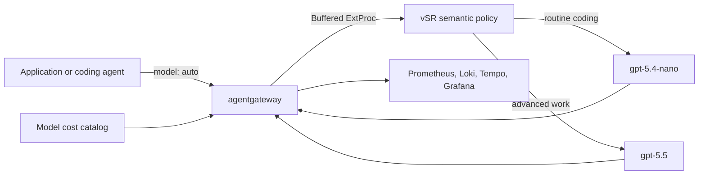

# Cost-based semantic routing

This is a focused demonstration of how [agentgateway](https://agentgateway.dev/)
and [vLLM Semantic Router (vSR)](https://vllm-semantic-router.com/) can reduce
LLM spend without making answer quality invisible. vSR sends routine Go and Rust
developer requests to `gpt-5.4-nano` and routes advanced distributed-systems,
correctness, and deep-debugging work to `gpt-5.5`. Agentgateway records the
selected model, tokens, catalog-priced cost, latency, logs, and traces.

The demo compares only two lanes:

| Lane | Purpose |
|---|---|
| `routed` | vSR selects the model for each request. |
| `always_expensive` | Every request uses `gpt-5.5`; this is the cost and answer-quality baseline. |

The lower-cost model is part of the routing outcome, not a third benchmark
lane. That keeps the central question clear: does semantic routing cost less
than always using the expensive model, while the sampled answers remain useful?

## Architecture



vSR classifies the request using its configured semantic, complexity, keyword,
context, and structure signals. It does not use the historic dollar cost of a
request as a classifier input. Agentgateway accounts for the realized outcome
after the model call.

## Requirements

- Docker with at least 12 GB of memory for the full observability profile
- 30 GB of free disk for the full profile, vSR model cache, and images
- `kind` 0.29 or newer, `kubectl`, `helm`, `curl`, `git`, and Python 3
- An `OPENAI_API_KEY` with access to `gpt-5.4-nano` and `gpt-5.5`

The script installs Kubernetes components but not host CLIs. It downloads a
checksum-verified `agctl` binary when necessary. The free-space guard is 30 GB
for `full`, 20 GB for `metrics`, and 15 GB for `none`; use
`MIN_FREE_DISK_GB` only when Docker storage is on a different filesystem.

## Run the demo

```bash
git clone https://github.com/danehans/agentgateway-demos.git
cd agentgateway-demos/cost-based-semantic-routing

export OPENAI_API_KEY='sk-...'
CAPTURE_OUTPUT=true ./demo.sh all --yes
```

`all` creates or reuses the dedicated `agentgateway-cost-routing` kind cluster,
using the `agentgateway-system` and `telemetry` namespaces. It performs these
steps before the primary evaluation:

1. Installs MetalLB, Gateway API, agentgateway, the model cost catalog, vSR,
   and the OpenTelemetry stack.
2. Verifies pod rollouts, storage, services, port-forwards, HTTP and gRPC
   readiness endpoints, the model catalog, and the Gateway listener.
3. Verifies buffered ExtProc routing with one routine and one advanced request.
4. Verifies catalog-priced cost, token, duration, log, and trace signals.
5. Runs the sample through the two evaluation lanes and produces a summary.

Each readiness and telemetry check retries within a bounded timeout and fails
with the final diagnostic when it cannot become healthy. `setup` does not send
OpenAI requests. `all` sends 54 small billable requests by default: two routing
probes, four smoke-test requests, and 48 primary evaluation requests.

The checked-in corpus contains 24 concise Go and Rust developer prompts: 12
routine implementation or test tasks and 12 advanced correctness or
distributed-systems tasks. It is deliberately small enough to run repeatedly
and is a demonstration sample, not a production benchmark.

To make paired answers reviewable at this scale, the runner sends
`reasoning_effort: none` to both lanes, asks for a direct answer, and applies
256-token limits to routine prompts and 1024-token limits to advanced prompts.
This holds the request policy constant while vSR changes the model tier. It is
a deliberate demo setting, not a recommendation for every production workload;
adjust the request parameters and quality check together for work that needs a
higher reasoning budget.

For slower environments, extend the retry windows:

```bash
VERIFY_TIMEOUT_SEC=600 \
VSR_READY_TIMEOUT_SEC=1800 \
SIGNAL_TIMEOUT_SEC=300 \
./demo.sh all --yes
```

For a lower-resource stack, use `OBSERVABILITY_PROFILE=metrics`. Set it to
`none` only when catalog-backed Prometheus verification is not required; the
local result summary still works.

## Read the result

Each run writes these files under `results/`:

- `<RUN_ID>.jsonl`: per-request model selection, token usage, cost estimate,
  latency, and optional response text
- `<RUN_ID>-metadata.json`: component versions, fetched example revision, and
  sample path
- `<RUN_ID>-summary.json` and `.txt`: local and experiment-scoped Prometheus
  cost, model mix, routing diagnostic, and latency data
- `<RUN_ID>-chart.svg`: spend, routed model mix, blinded A/B acceptance, and
  end-to-end latency in one shareable chart

The report uses a unique `experiment_id`, not a broad time window. When
Prometheus is enabled, agentgateway token metrics are priced with the loaded
model catalog and every lookup must be exact. That catalog-priced report is the
cost source of record. The local token-cost calculation remains in the summary
as a fallback and same-token counterfactual.

The text summary still includes corpus-label selection agreement as a routing
diagnostic. It is not presented as proof of answer quality and is not used in
the chart's primary claim.

Regenerate the chart later without a Kubernetes cluster:

```bash
SUMMARY_FILE=results/<RUN_ID>-summary.json ./demo.sh chart
```

## Check answers without turning this into an eval platform

`CAPTURE_OUTPUT=true` saves the paired answers. After a run, create a blinded
A/B spot check:

```bash
RESULT_FILE=results/<RUN_ID>.jsonl ./demo.sh review
```

By default the script randomly selects 12 prompts and creates a CSV containing
the request transcript plus shuffled answers `A` and `B`. Give reviewers the
CSV and the generated instructions, but keep the blind-key JSON separate. To
review more or fewer prompts, set `REVIEW_LIMIT`; `0` includes all 24.

For each answer reviewers record a 1-to-5 quality score, whether it is
acceptable for the task, and whether one answer is materially better. After the
CSV is complete, score it and refresh the report and chart:

```bash
RESULT_FILE=results/<RUN_ID>.jsonl ./demo.sh score
```

The answer signal is reported as routed accepted answers divided by
always-expensive accepted answers, together with the number of cases where the
routed answer was judged materially worse. This is intentionally a lightweight
quality spot check. It helps make a demo result honest, but it does not measure
production user satisfaction. Measure satisfaction in the application with
task completion, user feedback, retries, and escalation rates.

## Commands and tuning

```bash
./demo.sh setup       # Install the cluster components without model traffic
./demo.sh verify      # Verify buffered ExtProc selects both model tiers
./demo.sh eval        # Run the smoke test and two-lane evaluation
./demo.sh report      # Regenerate summaries from the latest result
./demo.sh chart       # Render the latest SVG chart
./demo.sh review      # Create a blinded A/B answer spot check
./demo.sh score       # Score the completed review and refresh artifacts
./demo.sh router      # Redeploy vSR after editing its fetched values
./demo.sh status      # Show deployed resources and example revision
./demo.sh dashboard   # Port-forward Grafana to http://localhost:3000
./demo.sh cleanup     # Delete the demo cluster or its namespaces
```

Use `EVAL_LIMIT` to run the first N prompts in the sample. The runner always
uses the two lanes listed above and randomizes their request order.

The editable vSR values are fetched from the selected agentgateway revision:

```text
../.work/cost-based-semantic-routing/agentgateway/examples/llm-semantic-routing/k8s/semantic-router-values.yaml
```

After changing the policy, redeploy it with `./demo.sh router`, then rerun the
demo. The vSR chart and ExtProc image are pinned to `0.3.0` and `v0.3.0` for a
consistent baseline. Override both together when validating a new release:

```bash
VSR_CHART_VERSION=0.3.0 VSR_IMAGE_TAG=v0.3.0 ./demo.sh setup
```

The default upstream example revision is `main`. For a reproducible run, set a
merged agentgateway commit SHA and refresh the fetched example:

```bash
EXAMPLE_REF=<agentgateway-commit-sha> ./demo.sh refresh --yes
```

## Resources

- [agentgateway semantic-routing example](https://github.com/agentgateway/agentgateway/tree/main/examples/llm-semantic-routing)
- [agentgateway model cost catalog](https://agentgateway.dev/docs/kubernetes/main/llm/costs/)
- [agentgateway cost tracking](https://agentgateway.dev/docs/kubernetes/main/llm/cost-tracking/)
- [agentgateway OpenTelemetry stack](https://agentgateway.dev/docs/kubernetes/main/observability/otel-stack/)
- [vSR agentgateway integration](https://vllm-semantic-router.com/docs/installation/k8s/agentgateway/)
