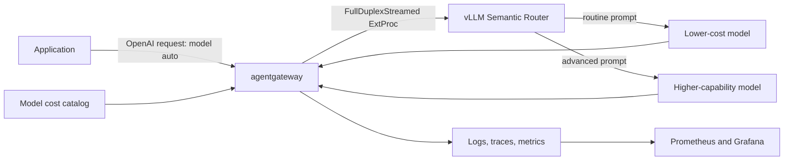

# Cost-based semantic routing

This demo combines agentgateway and vLLM Semantic Router (vSR) to route routine
prompts to a lower-cost model and advanced prompts to a higher-capability model.
It then measures whether that policy reduces realized LLM cost without hiding
the effects on routing accuracy, answer quality, or latency.

The Kubernetes resources and evaluation tooling come directly from
[agentgateway/agentgateway#2486](https://github.com/agentgateway/agentgateway/pull/2486).
This repository supplies the prerequisites and a reproducible command surface
around that example.

## Architecture



vSR does not learn from historical request costs in this example. It classifies
each incoming prompt from semantic, complexity, keyword, context, and structure
signals. The policy maps that estimated need to a model tier. Agentgateway then
prices the realized request and provides the evidence used to tune the policy.

## Requirements

- Docker with at least 12 GB of memory for the default full observability stack
- At least 30 GB of free disk for images, the vSR model cache, and telemetry data
- `kind` 0.29 or newer, `kubectl`, `helm`, `curl`, `git`, and Python 3
- An OpenAI API key with access to both models configured by PR #2486

The script installs Kubernetes components, but it does not install host CLI
tools. It supports macOS and Linux and downloads a checksum-verified `agctl`
binary when one is not already installed.

The preflight check requires 30 GB free for the full profile, 20 GB for the
metrics profile, and 15 GB without observability. Override `MIN_FREE_DISK_GB`
only when the host filesystem does not reflect the capacity available to your
Docker runtime.

## Quick start

```bash
git clone https://github.com/danehans/agentgateway-demos.git
cd agentgateway-demos/cost-based-semantic-routing

export OPENAI_API_KEY='sk-...'
# Optional: export HF_TOKEN='hf_...' for higher model-download rate limits
./demo.sh all
```

The command pauses before sending billable OpenAI traffic. Use `--yes` for a
non-interactive run:

```bash
CAPTURE_OUTPUT=true ./demo.sh all --yes
```

The default evaluation uses all 20 corpus prompts. It first runs a two-prompt
smoke test and stops if either model is unavailable, preventing a full run of
known failures.

## What the script does

`./demo.sh all` performs the following steps:

1. Creates or reuses the dedicated `agentgateway-cost-routing` kind cluster.
2. Installs MetalLB, Gateway API, and stable agentgateway Helm charts.
3. Downloads `agctl` and imports current OpenAI pricing into a model catalog.
4. Stores the catalog in a ConfigMap and attaches it to the Gateway-level
   `AgentgatewayParameters` resource.
5. Installs Prometheus, Grafana, OpenTelemetry collectors, Loki, and Tempo.
6. Fetches `refs/pull/2486/head` and records the resolved commit SHA.
7. Installs vSR from the PR's Helm values and applies its three experiment lanes.
8. Verifies streamed ExtProc with an immediate response that consumes no model
   tokens and never reaches OpenAI.
9. Sends every selected corpus prompt through `routed`, `always_low_cost`, and
   `always_expensive`, then summarizes cost, accuracy, and latency.

Every phase is gated by a post-install check. The script stops at the first
component that remains unhealthy after its retry window:

| Phase | Required checks |
|---|---|
| kind and MetalLB | Kubernetes readiness, storage class, controller and speaker rollout, address-pool configuration |
| agentgateway | Gateway API and agentgateway CRDs, controller rollout, accepted GatewayClass, programmed proxy, successful catalog mount/load, and LoadBalancer HTTP access |
| OpenAI and catalog | authenticated `/v1/models` access, Kubernetes Secret, ConfigMap, and priced catalog entries for every eval model |
| vSR | deployment rollout, bound model-cache PVC, `/ready`, `/config/router`, ExtProc gRPC connectivity, and `/metrics` |
| Metrics stack | Prometheus and Grafana rollouts, PromQL execution, Grafana datasource health, OTel scrape/remote-write pipeline, and dashboard discovery |
| Full OTel stack | Loki and Tempo readiness, log and trace collector connectivity, Loki datasource health, and Tempo datasource configuration |
| Immediate probe | streamed ExtProc response plus agentgateway request/latency metrics and correlated Loki/Tempo records |
| Paid smoke | nonzero catalog-priced cost derived from token metrics, exact catalog-lookup counters, token and LLM-duration metrics, all three experiment lanes, and cost-bearing correlated logs/traces |

The standalone `verify` and `eval` commands repeat the deployed-stack checks
before probing or sending paid traffic. This catches components that became
unhealthy after the original setup completed.

Port-forward checks use temporary free local ports and are cleaned up on exit.
Failed checks are retried without flooding the terminal; the final diagnostic is
printed from `.work/cost-based-semantic-routing/last-verification.log`.

The default timeout is five minutes, vSR receives twenty minutes for model
downloads, and telemetry signals receive three minutes for export and indexing.
Tune these windows for slower environments:

```bash
VERIFY_TIMEOUT_SEC=600 \
VSR_READY_TIMEOUT_SEC=1800 \
SIGNAL_TIMEOUT_SEC=300 \
VERIFY_INTERVAL_SEC=5 \
./demo.sh all
```

The wrapper intentionally does not copy the PR's routing configuration or eval
logic. It runs these files from the fetched revision:

- `k8s/semantic-router-values.yaml`
- `k8s/agentgateway-experiment.yaml`
- `data/eval-corpus.jsonl`
- `scripts/run_eval.py`
- `scripts/summarize_results.py`

The PR enables persistent vSR model storage on kind's `standard` storage class.
The first setup downloads the local classification and embedding models; tuning
redeploys reuse that cache.

The demo pins the vSR `0.3.0` Helm chart and `v0.3.0` `extproc` image so repeated
runs use the same release. Override both pins together when testing an upgrade:

```bash
VSR_CHART_VERSION=0.3.0 VSR_IMAGE_TAG=v0.3.0 ./demo.sh setup
```

Use a commit SHA instead of the moving PR ref for a reproducible publication
run:

```bash
EXAMPLE_REF=1de2d4d5f2dea807581fe4d3178a3a4cbfc5711c ./demo.sh refresh
```

## Commands

```bash
./demo.sh setup       # Install the cluster components without paid traffic
./demo.sh verify      # Test streamed ExtProc without calling OpenAI
./demo.sh eval        # Run the paid smoke test and experiment
./demo.sh report      # Regenerate local and Prometheus summary artifacts
./demo.sh status      # Inspect resources and the resolved PR revision
./demo.sh dashboard   # Open a Grafana port-forward on localhost:3000
./demo.sh cleanup     # Delete the dedicated cluster
```

For a smaller evaluation:

```bash
EVAL_LIMIT=4 ./demo.sh eval
```

For a lower-resource metrics-only stack:

```bash
OBSERVABILITY_PROFILE=metrics ./demo.sh all
```

Set `OBSERVABILITY_PROFILE=none` to skip Prometheus, Grafana, Loki, Tempo, and
the OpenTelemetry collectors. The local JSONL summary still works, but
agentgateway's catalog-backed Prometheus cost report is unavailable.

## Experiment lanes

| Lane | Model selection | Purpose |
|---|---|---|
| `routed` | vSR selects the model | Treatment |
| `always_low_cost` | Lower-cost model is forced | Cost and quality floor |
| `always_expensive` | Higher-capability model is forced | Savings counterfactual |

The runner randomizes prompt/lane order and adds request, experiment, eval, and
lane identifiers. Agentgateway adds `experiment_id` and `eval_lane` to
Prometheus metrics and sends the identifiers to access logs and traces when the
full profile is enabled.

Results are written to `results/`:

- `<RUN_ID>.jsonl`: request-level decisions, usage, cost estimate, and latency
- `<RUN_ID>-metadata.json`: component versions and resolved example SHA
- `<RUN_ID>-ratings.csv`: created when `CAPTURE_OUTPUT=true`
- `<RUN_ID>-summary.json`: structured local and catalog-backed Prometheus results
- `<RUN_ID>-summary.txt`: readable cost, accuracy, satisfaction, and latency report

The local summary estimates cost from response token usage and the example's
rate table. The Prometheus summary scopes agentgateway token metrics to the run,
prices them with the generated model catalog, and requires every catalog lookup
to be `Exact`. Report generation waits until the lookup count covers every
result row, preventing a partial scrape from understating cost. Agentgateway's
access logs and traces provide the independent per-request realized-cost
signal. Treat the catalog-priced Prometheus summary
as the experiment's cost source of record. `./demo.sh report` regenerates both
summary artifacts for `results/<RUN_ID>.jsonl`, or for `RESULT_FILE` when it is
set. When Prometheus is disabled or unavailable, that status and reason are
preserved in both artifacts instead of silently omitting the section.
Existing demo checkouts that fetched an older PR revision must run
`./demo.sh refresh --yes` once to obtain structured-summary support.

## Tune the routing policy

After setup, the editable vSR values are located at:

```text
../.work/cost-based-semantic-routing/agentgateway/examples/llm-semantic-routing/k8s/semantic-router-values.yaml
```

The first tuning lever is the threshold for `advanced_need_band`. Lowering it
routes more boundary prompts to the higher-capability model; raising it favors
the lower-cost model. You can also adjust signal weights, keyword sets,
embedding candidates, and complexity examples.

Redeploy and rerun after editing:

```bash
./demo.sh router
./demo.sh eval
```

Review false negatives first: advanced prompts sent to the lower-cost model.
Then inspect false positives, where routine prompts consumed the expensive
model. A production threshold should optimize for an explicit quality SLO, not
the highest possible savings percentage.

`./demo.sh refresh` discards local tuning and fetches `EXAMPLE_REF` again.

## Evaluate satisfaction

Capture response text for blinded human review:

```bash
CAPTURE_OUTPUT=true ./demo.sh eval
```

Fill in the generated ratings CSV with a satisfaction score and whether the
router chose the right model. Then regenerate the persisted summaries; the
ratings file is detected automatically:

```bash
RESULT_FILE=results/<RUN_ID>.jsonl ./demo.sh report
```

`CAPTURE_OUTPUT=true` stores response text in the request-level JSONL and
creates the ratings CSV. It does not redirect the command's terminal output;
the `-summary.json` and `-summary.txt` files are created independently.

## Model availability

The configured model names come from the fetched PR revision. Model catalog
entries do not grant API access. If OpenAI returns `model_not_found`, verify the
model IDs and project access, update PR #2486, refresh this demo, and rerun. The
smoke result file preserves the exact error response for diagnosis.

## Resources

- [Cost-based routing example PR](https://github.com/agentgateway/agentgateway/pull/2486)
- [agentgateway model costs](https://agentgateway.dev/docs/kubernetes/main/llm/costs/)
- [agentgateway cost tracking](https://agentgateway.dev/docs/kubernetes/main/llm/cost-tracking/)
- [agentgateway OTel stack](https://agentgateway.dev/docs/kubernetes/main/observability/otel-stack/)
- [vSR agentgateway integration](https://vllm-semantic-router.com/docs/installation/k8s/agentgateway/)
- [vSR streamed ExtProc](https://vllm-semantic-router.com/docs/installation/k8s/streamed-extproc/)
