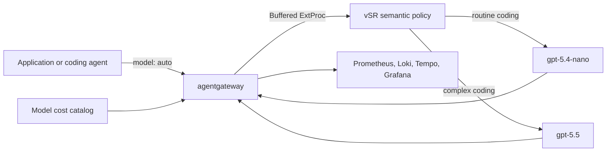

# Cost-based semantic routing

This reproducible demo shows how [agentgateway](https://agentgateway.dev/) and
[vLLM Semantic Router (vSR)](https://vllm-semantic-router.com/) can lower LLM
spend without sending every request to the cheapest model. vSR sends routine Go
and Rust coding tasks to `gpt-5.4-nano` and sends more complex correctness,
distributed-systems, and deep-debugging tasks to `gpt-5.5`.

Agentgateway records the selected model, token use, catalog-priced cost,
latency, logs, and traces. The result is a small, shareable evaluation that
answers four questions:

1. Did semantic routing cost less than always using `gpt-5.5`?
2. Did the router use both model tiers rather than save money by choosing nano
   for everything?
3. Did it escalate a reasonable share of the explicitly complex prompts?
4. What latency trade-off did the policy introduce?

## Architecture



vSR classifies the request from configured semantic, complexity, keyword,
context, and structure signals. It does not use historic request cost as an
input. Agentgateway prices the realized request after the selected model
responds.

## Requirements

- Docker with at least 12 GB of memory
- 30 GB of free disk for the full observability profile, images, and vSR cache
- `kind` 0.29 or newer, `kubectl`, `helm`, `curl`, `git`, and Python 3
- An `OPENAI_API_KEY` with access to `gpt-5.4-nano` and `gpt-5.5`

The script installs Kubernetes components but not host CLIs. It downloads a
checksum-verified `agctl` binary when necessary.

## Run the demo

```bash
git clone https://github.com/danehans/agentgateway-demos.git
cd agentgateway-demos/cost-based-semantic-routing

export OPENAI_API_KEY='sk-...'
./demo.sh all --yes
```

`all` creates or reuses the dedicated `agentgateway-cost-routing` kind cluster
and uses the `agentgateway-system` and `telemetry` namespaces. Before its
primary evaluation, it installs MetalLB, agentgateway, the model cost catalog,
vSR, and the OpenTelemetry stack. It verifies component rollouts, storage,
services, port-forwards, HTTP and gRPC readiness endpoints, the model catalog,
the Gateway listener, buffered ExtProc routing, and catalog-priced metrics,
logs, and traces.

Each check retries for a bounded period and exits with a diagnostic if it cannot
become healthy. `setup` makes no OpenAI requests. `all` sends 54 small billable
requests by default: two routing probes, four smoke-test requests, and 48
primary requests.

The dataset has 24 concise Go and Rust developer prompts: 12 routine
implementation or test tasks and 12 complex correctness or distributed-systems
tasks. The runner holds request settings constant across both lanes, including
`reasoning_effort: none`. Routine prompts have a 256-token cap and complex
prompts have a 1024-token cap.

## Read the result

Each run writes these files under `results/`:

- `<RUN_ID>.jsonl`: request-level selected model, tokens, catalog-derived local
  cost estimate, latency, and vSR decision headers
- `<RUN_ID>-metadata.json`: component versions and fetched example revision
- `<RUN_ID>-summary.json` and `.txt`: local and evaluation-scoped Prometheus
  data
- `<RUN_ID>-chart.svg`: spend, routing agreement, model mix, complex-prompt
  escalation, and latency

The chart uses two lanes only:

| Lane | Purpose |
|---|---|
| `routed` | vSR selects `gpt-5.4-nano` or `gpt-5.5`. |
| `always_expensive` | Every request uses `gpt-5.5`; the cost baseline. |

The result chart shows the routed model mix and the fraction of dataset prompts
labelled complex that vSR escalated to `gpt-5.5`. Together, those values make it
obvious whether the savings came from a real tiered policy rather than routing
everything to nano. It also shows dataset-label agreement as a simple policy
sanity check. This is not an answer-quality benchmark; it demonstrates that the
policy preserves an expensive tier for work the sample identifies as complex.

When Prometheus is enabled, agentgateway token metrics are priced with the
loaded model catalog and every lookup must be exact. That catalog-priced report
is the cost source of record. The local token-cost calculation remains in the
summary as a fallback and same-token counterfactual.

Regenerate a chart later without sending new model requests:

```bash
SUMMARY_FILE=results/<RUN_ID>-summary.json ./demo.sh chart
```

## Tune the policy

The vSR values come from the selected agentgateway example revision:

```text
../.work/cost-based-semantic-routing/agentgateway/examples/llm-semantic-routing/k8s/semantic-router-values.yaml
```

Adjust the routing signals, redeploy them, and run the same sample again:

```bash
./demo.sh router
./demo.sh eval --yes
```

The chart and summary make the trade-off visible. Increasing escalation to
`gpt-5.5` will generally improve the policy's complex-prompt coverage and raise
spend; lowering it does the opposite. The goal is a reasonable balance, not
100% agreement with a small checked-in dataset.

The vSR chart and ExtProc image are pinned to `0.3.0` and `v0.3.0` for a
consistent run. Override both together when validating a newer release:

```bash
VSR_CHART_VERSION=0.3.0 VSR_IMAGE_TAG=v0.3.0 ./demo.sh setup
```

For a reproducible run after the upstream example has merged, pin a commit:

```bash
EXAMPLE_REF=<agentgateway-commit-sha> ./demo.sh refresh --yes
```

## Commands

```bash
./demo.sh setup       # Install the cluster components without model traffic
./demo.sh verify      # Verify buffered ExtProc selects both model tiers
./demo.sh eval        # Run the smoke test and two-lane evaluation
./demo.sh report      # Regenerate the summaries from the latest result
./demo.sh chart       # Render the latest SVG chart
./demo.sh router      # Redeploy vSR after editing the fetched values
./demo.sh status      # Show deployed resources and source revision
./demo.sh dashboard   # Port-forward Grafana to http://localhost:3000
./demo.sh cleanup     # Delete the demo cluster or its namespaces
```

Use `EVAL_LIMIT` to run the first N prompts. Use
`OBSERVABILITY_PROFILE=metrics` for a lower-resource stack, or `none` when
catalog-backed Prometheus verification is not required.

## Resources

- [agentgateway semantic-routing example](https://github.com/agentgateway/agentgateway/tree/main/examples/llm-semantic-routing)
- [agentgateway model cost catalog](https://agentgateway.dev/docs/kubernetes/main/llm/costs/)
- [agentgateway cost tracking](https://agentgateway.dev/docs/kubernetes/main/llm/cost-tracking/)
- [agentgateway OpenTelemetry stack](https://agentgateway.dev/docs/kubernetes/main/observability/otel-stack/)
- [vSR agentgateway integration](https://vllm-semantic-router.com/docs/installation/k8s/agentgateway/)
